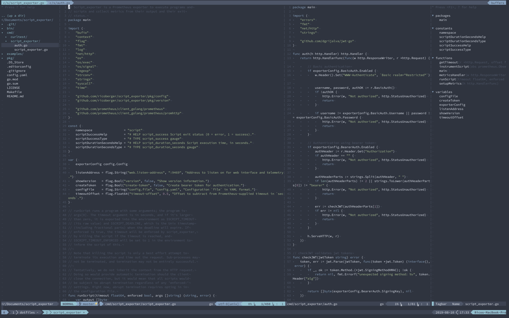

# dotfiles



## Usage

### Requirements

```sh
# Install the 'Source Code Pro for Powerline' font

# Install Homebrew and the dependencies
/usr/bin/ruby -e "$(curl -fsSL https://raw.githubusercontent.com/Homebrew/install/master/install)"
brew bundle

# Set ZSH as default shell
sudo sh -c "echo $(which zsh) >> /etc/shells"
chsh -s $(which zsh)
```

### Installation

```sh
git clone --recurse-submodules
cd dotfiles
./install.sh && source ~/.zshrc
```

## Features

### macOS

| Command         | Description                                           |
| --------------- | ----------------------------------------------------- |
| `tab`           | Open the current directory in a new tab               |
| `split_tab`     | Split the current terminal tab horizontally           |
| `vsplit_tab`    | Split the current terminal tab vertically             |
| `ofd`           | Open the current directory in a Finder window         |
| `pfd`           | Return the path of the frontmost Finder window        |
| `pfs`           | Return the current Finder selection                   |
| `cdf`           | `cd` to the current Finder directory                  |
| `pushdf`        | `pushd` to the current Finder directory               |
| `quick-look`    | Quick-Look a specified file                           |
| `man-preview`   | Open a specified man page in Preview app              |
| `showfiles`     | Show hidden files                                     |
| `hidefiles`     | Hide the hidden files                                 |
| `itunes`        | Control iTunes. Use `itunes -h` for usage details     |
| `spotify`       | Control Spotify and search by artist, album, track... |
| `rmdsstore`     | Remove .DS\_Store files recursively in a directory  |

### VS Code

| Alias                   | Command                        | Description                                                                                                 |
| ----------------------- | ------------------------------ | ----------------------------------------------------------------------------------------------------------- |
| vsc                     | code .                         | Open the current folder in VS code                                                                          |
| vsca `dir`              | code --add `dir`               | Add folder(s) to the last active window                                                                     |
| vscd `file` `file`      | code --diff `file` `file`      | Compare two files with each other.                                                                          |
| vscg `file:line[:char]` | code --goto `file:line[:char]` | Open a file at the path on the specified line and character position.                                       |
| vscn                    | code --new-window              | Force to open a new window.                                                                                 |
| vscr                    | code --reuse-window            | Force to open a file or folder in the last active window.                                                   |
| vscw                    | code --wait                    | Wait for the files to be closed before returning.                                                           |
| vscu `dir`              | code --user-data-dir `dir`     | Specifies the directory that user data is kept in. Can be used to open multiple distinct instances of Code. |

### kubectl

| Alias   | Command                             | Description                                                                                      |
| ------- | ----------------------------------- | ------------------------------------------------------------------------------------------------ |
| k       | `kubectl`                           | The kubectl command                                                                              |
| kca     | `kubectl --all-namespaces`          | The kubectl command targeting all namespaces                                                     |
| kaf     | `kubectl apply -f`                  | Apply a YML file                                                                                 |
| keti    | `kubectl exec -ti`                  | Drop into an interactive terminal on a container                                                 |
|         |                                     | **Manage configuration quickly to switch contexts between local, dev and staging**               |
| kcuc    | `kubectl config use-context`        | Set the current-context in a kubeconfig file                                                     |
| kcsc    | `kubectl config set-context`        | Set a context entry in kubeconfig                                                                |
| kcdc    | `kubectl config delete-context`     | Delete the specified context from the kubeconfig                                                 |
| kccc    | `kubectl config current-context`    | Display the current-context                                                                      |
| kcgc    | `kubectl config get-contexts`       | List of contexts available                                                                       |
|         |                                     | **General aliases**                                                                              |
| kdel    | `kubectl delete`                    | Delete resources by filenames, stdin, resources and names, or by resources and label selector    |
| kdelf   | `kubectl delete -f`                 | Delete a pod using the type and name specified in -f argument                                    |
|         |                                     | **Pod management**                                                                               |
| kgp     | `kubectl get pods`                  | List all pods in ps output format                                                                |
| kgpw    | `kgp --watch`                       | After listing/getting the requested object, watch for changes                                    |
| kgpwide | `kgp -o wide`                       | Output in plain-text format with any additional information. For pods, the node name is included |
| kep     | `kubectl edit pods`                 | Edit pods from the default editor                                                                |
| kdp     | `kubectl describe pods`             | Describe all pods                                                                                |
| kdelp   | `kubectl delete pods`               | Delete all pods matching passed arguments                                                        |
| kgpl    | `kgp -l`                            | Get pod by label. Example: `kgpl "app=myapp" -n myns`                                            |
|         |                                     | **Service management**                                                                           |
| kgs     | `kubectl get svc`                   | List all services in ps output format                                                            |
| kgsw    | `kgs --watch`                       | After listing all services, watch for changes                                                    |
| kgswide | `kgs -o wide`                       | After listing all services, output in plain-text format with any additional information          |
| kes     | `kubectl edit svc`                  | Edit services(svc) from the default editor                                                       |
| kds     | `kubectl describe svc`              | Describe all services in detail                                                                  |
| kdels   | `kubectl delete svc`                | Delete all services matching passed argument                                                     |
|         |                                     | **Ingress management**                                                                           |
| kgi     | `kubectl get ingress`               | List ingress resources in ps output format                                                       |
| kei     | `kubectl edit ingress`              | Edit ingress resource from the default editor                                                    |
| kdi     | `kubectl describe ingress`          | Describe ingress resource in detail                                                              |
| kdeli   | `kubectl delete ingress`            | Delete ingress resources matching passed argument                                                |
|         |                                     | **Namespace management**                                                                         |
| kgns    | `kubectl get namespaces`            | List the current namespaces in a cluster                                                         |
| kcn     | `kubectl config set-context ...`    | Change current namespace                                                                         |
| kens    | `kubectl edit namespace`            | Edit namespace resource from the default editor                                                  |
| kdns    | `kubectl describe namespace`        | Describe namespace resource in detail                                                            |
| kdelns  | `kubectl delete namespace`          | Delete the namespace. WARNING! This deletes everything in the namespace                          |
|         |                                     | **ConfigMap management**                                                                         |
| kgcm    | `kubectl get configmaps`            | List the configmaps in ps output format                                                          |
| kecm    | `kubectl edit configmap`            | Edit configmap resource from the default editor                                                  |
| kdcm    | `kubectl describe configmap`        | Describe configmap resource in detail                                                            |
| kdelcm  | `kubectl delete configmap`          | Delete the configmap                                                                             |
|         |                                     | **Secret management**                                                                            |
| kgsec   | `kubectl get secret`                | Get secret for decoding                                                                          |
| kdsec   | `kubectl describe secret`           | Describe secret resource in detail                                                               |
| kdelsec | `kubectl delete secret`             | Delete the secret                                                                                |
|         |                                     | **Deployment management**                                                                        |
| kgd     | `kubectl get deployment`            | Get the deployment                                                                               |
| kgdw    | `kgd --watch`                       | After getting the deployment, watch for changes                                                  |
| kgdwide | `kgd -o wide`                       | After getting the deployment, output in plain-text format with any additional information        |
| ked     | `kubectl edit deployment`           | Edit deployment resource from the default editor                                                 |
| kdd     | `kubectl describe deployment`       | Describe deployment resource in detail                                                           |
| kdeld   | `kubectl delete deployment`         | Delete the deployment                                                                            |
| ksd     | `kubectl scale deployment`          | Scale a deployment                                                                               |
| krsd    | `kubectl rollout status deployment` | Check the rollout status of a deployment                                                         |
| kres    | `kubectl set env $@ REFRESHED_AT=`  | Recreate all pods in deployment with zero-downtime                                             |
|         |                                     | **Rollout management**                                                                           |
| kgrs    | `kubectl get rs`                    | To see the ReplicaSet `rs` created by the deployment                                             |
| krh     | `kubectl rollout history`           | Check the revisions of this deployment                                                           |
| kru     | `kubectl rollout undo`              | Rollback to the previous revision                                                                |
|         |                                     | **Port forwarding**                                                                              |
| kpf     | `kubectl port-forward`              | Forward one or more local ports to a pod                                                         |
|         |                                     | **Tools for accessing all information**                                                          |
| kga     | `kubectl get all`                   | List all resources in ps format                                                                  |
| kgaa    | `kubectl get all --all-namespaces`  | List the requested object(s) across all namespaces                                               |
|         |                                     | **Logs**                                                                                         |
| kl      | `kubectl logs`                      | Print the logs for a container or resource                                                       |
| klf     | `kubectl logs -f`                   | Stream the logs for a container or resource (follow)                                             |
|         |                                     | **File copy**                                                                                    |
| kcp     | `kubectl cp`                        | Copy files and directories to and from containers                                                |
|         |                                     | **Node management**                                                                              |
| kgno    | `kubectl get nodes`                 | List the nodes in ps output format                                                               |
| keno    | `kubectl edit node`                 | Edit nodes resource from the default editor                                                      |
| kdno    | `kubectl describe node`             | Describe node resource in detail                                                                 |
| kdelno  | `kubectl delete node`               | Delete the node                                                                                  |
|         |                                     | **Persistent Volume Claim management**                                                           |
| kgpvc   | `kubectl get pvc`                   | List all PVCs                                                                                    |
| kgpvcw  | `kgpvc --watch`                     | After listing/getting the requested object, watch for changes                                    |
| kepvc   | `kubectl edit pvc`                  | Edit pvcs from the default editor                                                                |
| kdpvc   | `kubectl describe pvc`              | Descirbe all pvcs                                                                                |
| kdelpvc | `kubectl delete pvc`                | Delete all pvcs matching passed arguments                                                        |
|         |                                     |                                                                                                  |
| kgss    | `kubectl get statefulset`           | List the statefulsets in ps format                                                               |
| kgssw   | `kgss --watch`                      | After getting the list of statefulsets, watch for changes                                        |
| kgsswide| `kgss -o wide`                      | After getting the statefulsets, output in plain-text format with any additional information      |
| kess    | `kubectl edit statefulset`          | Edit statefulset resource from the default editor                                                |
| kdss    | `kubectl describe statefulset`      | Describe statefulset resource in detail                                                          |
| kdelss  | `kubectl delete statefulset`        | Delete the statefulset                                                                           |
| ksss    | `kubectl scale statefulset`         | Scale a statefulset                                                                              |
| krsss   | `kubectl rollout status statefulset`| Check the rollout status of a deployment                                                         |

### Git

| Alias                | Command                                                                                                                       |
| -------------------- | ----------------------------------------------------------------------------------------------------------------------------- |
| g                    | git                                                                                                                           |
| ga                   | git add                                                                                                                       |
| gaa                  | git add --all                                                                                                                 |
| gapa                 | git add --patch                                                                                                               |
| gau                  | git add --update                                                                                                              |
| gav                  | git add --verbose                                                                                                             |
| gap                  | git apply                                                                                                                     |
| gb                   | git branch                                                                                                                    |
| gba                  | git branch -a                                                                                                                 |
| gbd                  | git branch -d                                                                                                                 |
| gbda                 | git branch --no-color --merged \| command grep -vE "^(\*\|\s*(master\|develop\|dev)\s*$)" \| command xargs -n 1 git branch -d |
| gbD                  | git branch -D                                                                                                                 |
| gbl                  | git blame -b -w                                                                                                               |
| gbnm                 | git branch --no-merged                                                                                                        |
| gbr                  | git branch --remote                                                                                                           |
| gbs                  | git bisect                                                                                                                    |
| gbsb                 | git bisect bad                                                                                                                |
| gbsg                 | git bisect good                                                                                                               |
| gbsr                 | git bisect reset                                                                                                              |
| gbss                 | git bisect start                                                                                                              |
| gc                   | git commit -v                                                                                                                 |
| gc!                  | git commit -v --amend                                                                                                         |
| gcn!                 | git commit -v --no-edit --amend                                                                                               |
| gca                  | git commit -v -a                                                                                                              |
| gca!                 | git commit -v -a --amend                                                                                                      |
| gcan!                | git commit -v -a --no-edit --amend                                                                                            |
| gcans!               | git commit -v -a -s --no-edit --amend                                                                                         |
| gcam                 | git commit -a -m                                                                                                              |
| gcsm                 | git commit -s -m                                                                                                              |
| gcb                  | git checkout -b                                                                                                               |
| gcf                  | git config --list                                                                                                             |
| gcl                  | git clone --recurse-submodules                                                                                                |
| gclean               | git clean -id                                                                                                                 |
| gpristine            | git reset --hard && git clean -dfx                                                                                            |
| gcm                  | git checkout master                                                                                                           |
| gcd                  | git checkout develop                                                                                                          |
| gcmsg                | git commit -m                                                                                                                 |
| gco                  | git checkout                                                                                                                  |
| gcount               | git shortlog -sn                                                                                                              |
| gcp                  | git cherry-pick                                                                                                               |
| gcpa                 | git cherry-pick --abort                                                                                                       |
| gcpc                 | git cherry-pick --continue                                                                                                    |
| gcs                  | git commit -S                                                                                                                 |
| gd                   | git diff                                                                                                                      |
| gdca                 | git diff --cached                                                                                                             |
| gdcw                 | git diff --cached --word-diff                                                                                                 |
| gdct                 | git describe --tags $(git rev-list --tags --max-count=1)                                                                      |
| gds                  | git diff --staged                                                                                                             |
| gdt                  | git diff-tree --no-commit-id --name-only -r                                                                                   |
| gdv                  | git diff -w $@ \| view -                                                                                                      |
| gdw                  | git diff --word-diff                                                                                                          |
| gf                   | git fetch                                                                                                                     |
| gfa                  | git fetch --all --prune                                                                                                       |
| gfg                  | git ls-files \| grep                                                                                                          |
| gfo                  | git fetch origin                                                                                                              |
| gg                   | git gui citool                                                                                                                |
| gga                  | git gui citool --amend                                                                                                        |
| ggf                  | git push --force origin $(current_branch)                                                                                     |
| ggfl                 | git push --force-with-lease origin $(current_branch)                                                                          |
| ggl                  | git pull origin $(current_branch)                                                                                             |
| ggp                  | git push origin $(current_branch)                                                                                             |
| ggpnp                | ggl && ggp                                                                                                                    |
| ggpull               | git pull origin "$(git_current_branch)"                                                                                       |
| ggpur                | ggu                                                                                                                           |
| ggpush               | git push origin "$(git_current_branch)"                                                                                       |
| ggsup                | git branch --set-upstream-to=origin/$(git_current_branch)                                                                     |
| ggu                  | git pull --rebase origin $(current_branch)                                                                                    |
| gpsup                | git push --set-upstream origin $(git_current_branch)                                                                          |
| ghh                  | git help                                                                                                                      |
| gignore              | git update-index --assume-unchanged                                                                                           |
| gignored             | git ls-files -v \| grep "^[[:lower:]]"                                                                                        |
| git-svn-dcommit-push | git svn dcommit && git push github master:svntrunk                                                                            |
| gk                   | gitk --all --branches                                                                                                         |
| gke                  | gitk --all $(git log -g --pretty=%h)                                                                                          |
| gl                   | git pull                                                                                                                      |
| glg                  | git log --stat                                                                                                                |
| glgp                 | git log --stat -p                                                                                                             |
| glgg                 | git log --graph                                                                                                               |
| glgga                | git log --graph --decorate --all                                                                                              |
| glgm                 | git log --graph --max-count=10                                                                                                |
| glo                  | git log --oneline --decorate                                                                                                  |
| glol                 | git log --graph --pretty='%Cred%h%Creset -%C(auto)%d%Creset %s %Cgreen(%cr) %C(bold blue)<%an>%Creset'                        |
| glols                | git log --graph --pretty='%Cred%h%Creset -%C(auto)%d%Creset %s %Cgreen(%cr) %C(bold blue)<%an>%Creset' --stat                 |
| glod                 | git log --graph --pretty='%Cred%h%Creset -%C(auto)%d%Creset %s %Cgreen(%ad) %C(bold blue)<%an>%Creset'                        |
| glods                | git log --graph --pretty='%Cred%h%Creset -%C(auto)%d%Creset %s %Cgreen(%ad) %C(bold blue)<%an>%Creset' --date=short           |
| glola                | git log --graph --pretty='%Cred%h%Creset -%C(auto)%d%Creset %s %Cgreen(%cr) %C(bold blue)<%an>%Creset' --all                  |
| glog                 | git log --oneline --decorate --graph                                                                                          |
| gloga                | git log --oneline --decorate --graph --all                                                                                    |
| glp                  | `_git_log_prettily`                                                                                                           |
| gm                   | git merge                                                                                                                     |
| gmom                 | git merge origin/master                                                                                                       |
| gmt                  | git mergetool --no-prompt                                                                                                     |
| gmtvim               | git mergetool --no-prompt --tool=vimdiff                                                                                      |
| gmum                 | git merge upstream/master                                                                                                     |
| gma                  | git merge --abort                                                                                                             |
| gp                   | git push                                                                                                                      |
| gpd                  | git push --dry-run                                                                                                            |
| gpf                  | git push --force-with-lease                                                                                                   |
| gpf!                 | git push --force                                                                                                              |
| gpoat                | git push origin --all && git push origin --tags                                                                               |
| gpu                  | git push upstream                                                                                                             |
| gpv                  | git push -v                                                                                                                   |
| gr                   | git remote                                                                                                                    |
| gra                  | git remote add                                                                                                                |
| grb                  | git rebase                                                                                                                    |
| grba                 | git rebase --abort                                                                                                            |
| grbc                 | git rebase --continue                                                                                                         |
| grbd                 | git rebase develop                                                                                                            |
| grbi                 | git rebase -i                                                                                                                 |
| grbm                 | git rebase master                                                                                                             |
| grbs                 | git rebase --skip                                                                                                             |
| grev                 | git revert                                                                                                                    |
| grh                  | git reset                                                                                                                     |
| grhh                 | git reset --hard                                                                                                              |
| groh                 | git reset origin/$(git_current_branch) --hard                                                                                 |
| grm                  | git rm                                                                                                                        |
| grmc                 | git rm --cached                                                                                                               |
| grmv                 | git remote rename                                                                                                             |
| grrm                 | git remote remove                                                                                                             |
| grset                | git remote set-url                                                                                                            |
| grt                  | cd "$(git rev-parse --show-toplevel \|\| echo .)"                                                                             |
| gru                  | git reset --                                                                                                                  |
| grup                 | git remote update                                                                                                             |
| grv                  | git remote -v                                                                                                                 |
| gsb                  | git status -sb                                                                                                                |
| gsd                  | git svn dcommit                                                                                                               |
| gsh                  | git show                                                                                                                      |
| gsi                  | git submodule init                                                                                                            |
| gsps                 | git show --pretty=short --show-signature                                                                                      |
| gsr                  | git svn rebase                                                                                                                |
| gss                  | git status -s                                                                                                                 |
| gst                  | git status                                                                                                                    |
| gsta                 | git stash push                                                                                                                |
| gsta                 | git stash save                                                                                                                |
| gstaa                | git stash apply                                                                                                               |
| gstc                 | git stash clear                                                                                                               |
| gstd                 | git stash drop                                                                                                                |
| gstl                 | git stash list                                                                                                                |
| gstp                 | git stash pop                                                                                                                 |
| gsts                 | git stash show --text                                                                                                         |
| gstall               | git stash --all                                                                                                               |
| gsu                  | git submodule update                                                                                                          |
| gts                  | git tag -s                                                                                                                    |
| gtv                  | git tag \| sort -V                                                                                                            |
| gtl                  | gtl(){ git tag --sort=-v:refname -n -l ${1}* }; noglob gtl                                                                    |
| gunignore            | git update-index --no-assume-unchanged                                                                                        |
| gunwip               | git log -n 1 \| grep -q -c "\-\-wip\-\-" && git reset HEAD~1                                                                  |
| gup                  | git pull --rebase                                                                                                             |
| gupv                 | git pull --rebase -v                                                                                                          |
| gupa                 | git pull --rebase --autostash                                                                                                 |
| gupav                | git pull --rebase --autostash -v                                                                                              |
| glum                 | git pull upstream master                                                                                                      |
| gwch                 | git whatchanged -p --abbrev-commit --pretty=medium                                                                            |
| gwip                 | git add -A; git rm $(git ls-files --deleted) 2> /dev/null; git commit --no-verify --no-gpg-sign -m "--wip-- [skip ci]"        |
