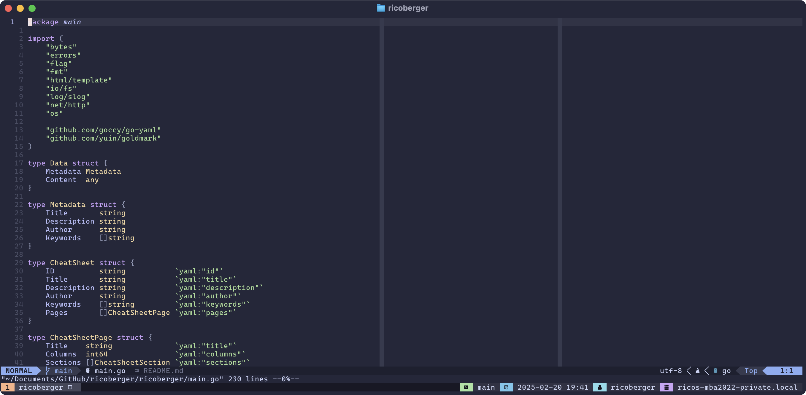

# dotfiles



## Usage

- Install the `Cascadia Code` font: [https://github.com/microsoft/cascadia-code](https://github.com/microsoft/cascadia-code)
- Install [Homebrew](https://brew.sh) and the Brewfile
  ```sh
  /usr/bin/ruby -e "$(curl -fsSL https://raw.githubusercontent.com/Homebrew/install/master/install)"
  brew bundle install --file=Brewfile
  ```
- Set zsh as default shell
  ```sh
  sudo sh -c "echo $(which zsh) >> /etc/shells"
  chsh -s $(which zsh)
  ```
- Clone and install the dotfiles
  ```sh
  git clone git@github.com:ricoberger/dotfiles.git
  cd dotfiles
  ./install.sh && source ~/.zshrc
  ```
